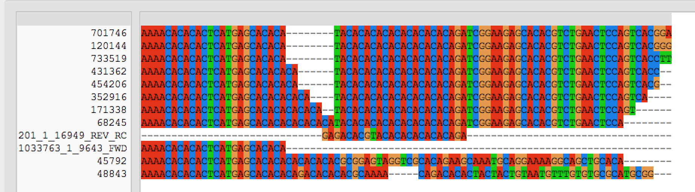

```{r, message=FALSE, warning=FALSE}
require(tidyverse)
require(knitr)
require(magrittr)
```

# Summary

First round of panel optimization and QC check for the albacore GTseq panel.

In this notebook we log two analyses using the data from the first GTseq panel data.

__Optimization__   
* Read distribution  
* Primer:probe ratios / marker specificity  
* Allele dropout  
* Primer dimers  

__Concordance with RADseq data__  
* Genotypes at re-genotyped samples the same?  
* Same structure revealed using GTseq data?  
* Sex marker validation?  

# Data and Metadata
## Sequence Data

Data is from the [illumina 019 run](https://docs.google.com/document/d/1KVyPwJp3YDkSBv8cpEaLxnwTmXt9h2wc/edit). Raw reads are at /dfs/Omalley_Lab/fitz/Runs/4773 and /dfs/Omalley_Lab/dayan/albacore/test_plate/raw_reads


## Panel Info

This is the test plate from the first draft panel (1.0). Panel info is available at the [lab GTseq github repo](https://github.com/State-Fisheries-Genomics-Lab/GT-seq/tree/main/Panel_info). The 1.0 panel has 317 markers (316+Sex Marker), derived from three analyses.

```{r, message=FALSE, warning=FALSE}
marker_summary <- readxl::read_xlsx("panel_info/albacore_gtseq_panel_1.0.xlsx", sheet=1)
marker_summary$maf <- as.numeric(marker_summary$maf)
DT::datatable(marker_summary, options = list(pageLength=10))
```

__Some notes on the table above__  
	Vaux_fst_outlier	is SNP one of the 84 fst outliers from to Vaux et al ms	
	spatial_axis1_outlier	is SNP a outlier for strong loading onto a redundant axis that strongly separates N from S Pacifc populations. see [link](https://github.com/david-dayan/Albacore_feature_selection/blob/main/feature_selection_notebook.html) for details	
	spatial_axis2_outlier	is SNP a outlier for strong loading onto a redundant axis that separates N Pacific samples from one another. see [link](https://github.com/david-dayan/Albacore_feature_selection/blob/main/feature_selection_notebook.html) for details	
	neutral_snp	is SNP randomly selected from the Vaux et al radtags	
			
			
Other Notes			
	"Neutral SNPs": Neutral SNPs attempt to capture genome wide variation and should be more suitable for estimating population genetic parameters that may be biased using other sets of SNPs: Neutral SNPs are based on the Vaux et al sequence data but used a different filtering approach. The empirical estimated site frequency spectrum indicated that the majority of the variants in among samples was substantially below the minor allele frequency cutoff used to generate the SNP dataset for the spatial and fst outlier analyses. To avoid biasing the SFS for the neutral SNPs, a new SNP dataset was called using less stringent filtering (minor allele count > 3, instead of minor allele frequency >5%). The "neutral" SNP dataset was then drawn from this dataset. A Kolmogorov-Smirnov test was used to check that the allele frequency sprectrum of the neutral SNP set used in this panel did not significantly differ from the allele frequency spectrum of the full SNP dataset. Details here: https://github.com/david-dayan/Albacore_feature_selection/blob/main/primer_design_input.html


## Sample Metadata

148 unique albacore samples were genotyped. All but 10 are samples from the Vaux dataset.

```{r}
sample_metadata <- readxl::read_xlsx("metadata/Tal_GBS-samples-for-GT-seq_210505.xlsx", sheet = 1)
```

# Data Prep

The first step is to decompress, merge and hash the raw reads.

```{bash, eval = FALSE}
#!/bin/bash
#$ -S /bin/bash
#$ -t 1-194
#$ -tc 30
#$ -N decompress_fastqs
#$ -cwd
#$ -o $JOB_NAME_$TASK_ID.out
#$ -e $JOB_NAME_$TASK_ID.err

FASTQS=(`ls -1 *fastq.gz`)
INFILE=${FASTQS[$SGE_TASK_ID -1]}

gunzip -c $INFILE > ./${INFILE%.gz}


#save this code chunk as a file on the server and submit this with qsub -q harold scriptname from the directory you want the output files
```

Next we'll build the hash files which we will use throughout this notebook.

```{bash, eval = FALSE}
#!/bin/bash
#$ -S /bin/bash
#$ -N merge_hash
#$ -cwd

#first merge all the fastqs
cat *fastq > merged_Tal.fasta

#then hash them
perl /dfs/Omalley_Lab/dayan/software/GTseq-Pipeline/GTseq_HashSeqs.pl merged_Tal.fasta > merged_Tal_hash.txt
```

The total number of reads in the test run is 294,883,769 . 

# SeqTest

The GTSeqTest script (from the gtseq pipeline) performs an exact matching search among the hash of reads from the test panel for (1) primer sequences, (2) probe sequences and (3) both 1 and 2 together in the same read. I have had some strange results when attempting to use this script in the past so wrote a different approach using seqkit and awk. Another note, the seqtest script searches for the full primer sequence, but the genotyper only uses the 14bp. Here we'll trim primers to 14bp before searching.

## Prep

__Primers__  
```{r, eval = FALSE}
primers <- as.data.frame(str_sub(marker_summary$fwd_primer, 0,14))
write_tsv(primers, "seq_test/primers_for_seqtest.txt", col_names = FALSE)
```


__"." as N?__
do "." work as degenerate bases in the genotyper? let's run a test genotyping script check

```{bash}
bash
export PERL5LIB='/home/fw/dayand/perl5/lib/perl5/x86_64-linux-thread-multi/'
GTSEQ_GENO="/dfs/Omalley_Lab/dayan/software/GTseq-Pipeline/GTseq_Genotyper_v3.1.pl"

FASTQ=./test.fastq

echo "fake_marker,T,A,CCTAA.AACT,CCAAA.AACT,GCTAAGTCAGTCTGCCTAA,0,0" | perl $GTSEQ_GENO - $FASTQ

```

Yes "." works as a degenerate base in the genotyper script.

__Probes__  
Nate Campbells probe sequences use . for degenerate bases, also we need to search for the reverse complement of the sequences as well. let's generate the list of probe sequences to search

```{r, eval = FALSE}
Tal_probes <- select(marker_summary, probe1, probe2)
Tal_probes %<>%
  mutate_all(funs(str_replace(., "\\.", "N"))) %>%
  mutate(probe1rc = insect::rc(probe1)) %>%
  mutate(probe2rc = insect::rc(probe2))

write_tsv(as.data.frame(paste(Tal_probes$probe1,Tal_probes$probe1rc,Tal_probes$probe2,Tal_probes$probe2rc, sep = ",")), "seq_test/probes_forseqtest.txt")

#note that the sex probe had a degerate base in the bracket format, wrote these out manually
```

## Scripts

Now we count primer hits in the hash file
```{bash, eval = FALSE}

#!/bin/bash
#$ -S /bin/bash
#$ -N primer_count
#$ -cwd
#$ -o $JOB_NAME.out
#$ -e $JOB_NAME.err

PRIMERS="TGTCAGGCTGAAAT
AGCAACTTCCTCTG
AATGAAAGGCTTTG
GCCTGTGAAAGTGC
AAGATTTTCACAAA
GTGCTGCAGAGTAT
TAGAGGTAGTGTGC
CCGATGCTGGGAAT
AACAGACAGAAAGA
CTGCAGCCCTGAGT
CTGGATAACTTTGA
GCATGCAGTTATAC
TACTTTACAGTGTT
TTCTCCCTGCCCCA
CCACCTTCTTGGAT
GAGGATCCAACAGC
GCTGCAGTTTGTAA
CTGTGTCAGTTAAT
AGTGAGTGTGTTGT
TGGCTAAATCCAGT
TCATTTTCTGCAAC
GATACAGGCTTGCT
GTGCGCGTGGACAG
CTTCCTCAGACGCA
AGAGGGGTTTGAGG
CATGGAGCTTTAAC
GCAGTACAAATTGG
TCCAGCTGTCCTTG
GCTCCATTTCCTTA
TTGAGTTCAGCAGT
ACGGGCAGTAAAGG
TGCATTTCCTGGGA
ATAGAGGACTTACT
ACCACAGACGGCAT
AGCGATGTTTGTCA
ACAGACCAATGAGG
TCATTTGCTGACTT
TCCACAAATACTTT
AGAGACTCACTGAA
TTGCCTTTCTGACC
GAATCAAGGCTTGC
GCCACTGCAGGAAG
GAGAGTTGCCGTCT
AAGAAAATAACAGT
AAGACCTCCATCGC
CCAGCACCTTGTTT
CTGTTGCTGAATGC
GTTGTGTCAGATGG
CGTGAGAGGGTTGG
TGGAAAGTGTTTAT
ATAAATGGCTTTGG
TGCTTAATACATGG
TCTCTCTTTCACCA
AACAGGTGTTTGGG
GAGTCTGTTAGTGT
ATCTGGTAAGTAGG
GATGGCTCCGAAAC
ACAGACATTGTAAA
TCTCTGCAGAATCT
AGGGATGAGAGGGA
GAGTGTTCCAGGTA
CAACATCTTCGCTC
GCCTTGGGTTGCAA
TTTTCGAACTCTGG
AACGATGGCTTAGT
ATTCACCTTCTGTC
AGTACAGTGCTTAG
GCGCCCTGCAGCTA
GCTATGTTTGCATG
AAAAGGGAAAAGGT
AGGTGAAACAGATT
GCTAAGTCAGTGTG
GTTATGCTAATTGG
GCCTTATGTATGAC
AGTGTGAAATGGAG
AGCATGCTTACAGT
GATGATAATGGGCG
TCTGATCTCCACCA
ATTCAAAGTGGCAA
GTAGACAGGCTGTG
GTGTGTGTCCTCTC
GAAATTCGATTTGA
TTTACCGTCCCTTT
GCAGCAGACATTTA
GACACCTAACACAG
TGAATGTAGGTTTG
CTTATCTATGTGAA
CTGTTAAAGCCGAC
CCTTCATGTCACGT
CCATGCATGCTCAT
TGTTTGTAGCATGC
AGTAAGACACACAC
ATACTAGCAGAGAC
TGGGGAAATGCTGA
AGTGACATCTGTGG
CAGTACCTTCAAGA
TGCCTGGAAAAGAA
CTCTGGGTCTGGGA
CGACTGTTTGTCCT
CAGATGATTCTGCA
CCTCACCCATCTTG
TAACTGCCTGCATG
GTTCATGTATGAGT
CCTCAGAAACTCTG
CTGGACATGTTCAA
ACCAGGAAGCCTCA
CTTCTGTATACTCT
TGAGCATTTCAACA
AAGCCTGAGATTTA
CATCTTCCATTCAC
CAAGACAGTGGTGA
TCACTGTCCTTTCT
ACGACAACATCCAC
CCTCCCTCCCACAC
GAGCTGTCCGTCTT
AAACTCATTCACCA
CTCATTTCCCCGGC
ATCCGGTGCTTTTT
TGATGTTTGGAGTC
AGTGTAGCAGAAAG
CAGCAAACCTTGGG
AAAACACACACTCA
CCTGTATGTGACTA
AGGATGTTCAAAGG
GAGAGGGTACGGAG
CCTGTTGACTGTGG
TGGCACATTTTGAG
CAGGGAGTTTGAGG
TGCTCACATGCATG
AGGCAAGTGCATAC
AACATGACCTATTT
GTTGCCCTTTCACA
CAGCCACAGCCCTC
TCCAGTATCTGAGA
ACCATGGGATATGA
ATGCGTGCATGCTC
TGACTGCCGACATC
GTCAGTTATGGTAT
ACTGCAGGGCCTTA
CCATCCTTGTGTTG
AATGCTCCTTGACC
TTGGCATCCTGGAA
ACACACCCCATCAA
GTGGGTATGTGAAT
GCAGTGCCACTAGT
ACTGCAGGGCTATG
GCCAGAGATTCCAG
AGTGAATCACAAAC
TGGCCCTATGTAAA
CAAAGGACTTGTGA
CACAATCAGCCTGT
GAGGAAGCCCTGCA
GCACTGCTACAACT
TGATATTCCTGTTT
GTAACAGTGGAGCA
CTGCGTGGGGGCTG
AGTAGCGTGATATG
ACATGAGTGGATTC
ACTGCAGAAGACAT
CCTTTCACTGCCGT
CCTGTCACAACACA
GCAGATACAGAGTA
AGCTCTCTTTCACT
AAGCCTGCTCAAAT
TGAGTTGCTGGGTT
TGAGGTTGACAGAG
TGGGAGAGAGCACA
CTCTGGGGAGAGCA
CCTTGAGGGCAGTT
CGTAGGTTGCCATG
TCCTGTGGACATCC
TTTTGGAGCTGTAG
TGACTCTTCTATGA
TTACATGCACAACT
AATACGAGAACCAG
ACTTTATTCACTGC
TCTCGTCTAAACAT
CTGCATGGAGTCAG
ACACAGCTTTGCCA
CCAAGCCCTCTACC
GAGGAATTTAACAA
GTCATCTGTGTCTG
AGAGATTAAAGAGG
TGCAACAACCAAAA
TGCATTGGAGATTT
TGACCCAAGAGTGT
TGGCTCAGACATGT
ATTGATGGGTCCTC
ACTGTGGAGTCCAT
ACGTTATGTAGCCC
TCCACCAATTTTGA
AAAATGAGAGACAG
TGTTGCATCCGGAT
TGAAACTCTCTACA
CTGATGCTGCTGTG
TTCTTGTCCCATTC
AACCTATCGCTGCC
TGTGTGGCTCTTCT
CCTGCAGGTGAATT
AGCATTGGATGTTT
TGTCTGACCCTGCA
CAGTGCGGGAATGT
GTTGTGTTCTGTCT
CATCACTGCCCCTG
GTTACATGACCACC
TTGTCCCGTTCAGA
GTTTAGTTGGAGCA
AAGGATACAAGGTG
ATGACACAGAGACA
TCCAGCAAATGTTC
TTGTAAGACAAACA
TGCTCAATGACGTT
AGCACCCTCAAAAA
CATCTGCACACGTT
TAAGGTGCATTTTC
CAAGTCCTGCTTTT
TTTGTAGTAAATGG
TGTAGGAGGAGTTG
CCTGCAGTGGAAGA
GACCCTGAATGCAT
TGTGTCATATTGCA
ACATCTAAGCTACA
AGGTGATTATACGT
AGAGGTGTGTTTCT
ACACCTGACAGAGT
ACTGCAGCTTTAGT
TTTAGAGGTGAACG
CCTGGCCAACCTTA
TGGCATCCCACCTC
TATTGGTGTGTTTG
AGTACGACTGCATG
CACTATTTGCATTA
GTCTCATAGAGAGC
ACGCAGGAAGTGGA
GCAACAAAAATAAG
CACATGCATGCTCT
ACACCTTCTCTATG
GACACTCCACCTTC
TCAACTTGTGTGAA
CCAGAGTGTGCCAC
TAGGTGCGTATGCT
ATTACAGCCTGCAT
GCCAAACAGCCTGA
TTTAGCCCCACTGT
TGTGATTCTGCTCT
AAGATGATGGCAAC
CCCACATGGCGGAA
GTGGGAAGCCTCCT
GCCTACAGACAACA
GATTCTCTCGCAGT
AGCCAGCCCTCTGA
GCTGCAAGACAAAG
TCAGACATCAGGCA
AAGAGGAGACACAC
TACTCTCTGACAAA
GAGGTGACTTTGAG
GTGATACCATACTG
AGGTAAAAAAAACC
TGAAGAAACCTGCA
CGAAACCGTACAGA
AATATGTGCGTGTG
CCATATGACTCCAG
CCTTTGAAGAAGCG
TTCCCTGCTCAGAT
AAAAGCCCCTCAAA
TTGCAGAGAGATAA
ATCAATGATGAGAG
CTTCCTTGTTTGTC
TGTAACAAGTACCT
ACACCATCCAACCT
TGTTCTCCGTTTCA
TGTGAGAGTGTGTG
CTTTATAAGCCCAG
TCTGTCTCTAGCTG
TCTTCTATCTGCAG
ACTCCACCCTGTTC
CTCAGTCTGGATGG
GAAATCAAACCGCA
CCCTTTCAGTTTCA
GTCCTCCCCTGGGA
GCATGCCTCTAAAC
TAGATGACACGACG
GCCCCTGTAGTGGT
GAAATGGATCACAA
AACCAACTTAACCA
ACTTAGTCACAGTG
TGAATAATGCAGCT
GAGCTCACCCATCT
TGCAGCACACTACT
TCCTTTGCATCCTG
ACGCTTGTCTTACT
TCATAAATGAGGGG
AGGGACTGGTTAAC
AGTAATTCACAGTT
GAATAACAGGCACC
AATCCGAGTGGCAT
CCATCAGTGATGCA
TCTCCACACACCGA
AGCATCACAGATTA
GCAGGACCACATGG
TGTCTTTGTTTCTC
CTTGAAAAAGCAGC
CAACCTGCAGCAAA
GCAGGAGAGAAGAG
TGCCAGGTTTGGGG
AATCCATCTGCCAT
AAGGTTAATGCAAC
TTTTGGTTGGCTGG
GACCTGGAACAAGA
ACGAGTGAACATAC
AAACCTCTTGCTCT
TGAAAGGAGCTAAG
TCTGTGGCATGCAT
CCGCCACTGTTTAC
ATCCAGATGCCGTC
GTGCTTGGCTCAGA
ACCCAGACTGAGAA
"

for i in $PRIMERS
do
cat merged_Tal_hash.txt | /dfs/Omalley_Lab/dayan/software/seqkit grep -s -i -p $i | grep ">" | awk -F ";" '{sum += $3} END {print sum}' >> Tal_1.0_primer_cts.txt
done


#save this file as a script and submit with qsub

```

Now we count probe sequences
```{bash, eval = FALSE}
#!/bin/bash
#$ -S /bin/bash
#$ -N probe_count
#$ -cwd
#$ -o $JOB_NAME.out
#$ -e $JOB_NAME.err

PROBES="AACTGGTATAT,ATATACCAGTT,AACTGATATAT,ATATATCAGTT
TAAACGGTGTG,CACACCGTTTA,TAAACAGTGTG,CACACTGTTTA
AGTGGTACTGA,TCAGTACCACT,AGTGGCACTGA,TCAGTGCCACT
AGTGACGCCTA,TAGGCGTCACT,AGTGATGCCTA,TAGGCATCACT
GACCNCATACA,TGTATGNGGTC,GACCNTATACA,TGTATANGGTC
TTCCCTGGTCT,AGACCAGGGAA,TTCCCCGGTCT,AGACCGGGGAA
GAGACGGATAA,TTATCCGTCTC,GAGACAGATAA,TTATCTGTCTC
GCTCCCCCAGT,ACTGGGGGAGC,GCTCCTCCAGT,ACTGGAGGAGC
CCACAGTCTTA,TAAGACTGTGG,CCACAATCTTA,TAAGATTGTGG
CTTATTGCTAT,ATAGCAATAAG,CTTATGGCTAT,ATAGCCATAAG
GCTCTCAAGAC,GTCTTGAGAGC,GCTCTTAAGAC,GTCTTAAGAGC
ATGACAGAGAA,TTCTCTGTCAT,ATGACTGAGAA,TTCTCAGTCAT
GCCATGCGGAA,TTCCGCATGGC,GCCATACGGAA,TTCCGTATGGC
CATCCCTTCAA,TTGAAGGGATG,CATCCTTTCAA,TTGAAAGGATG
GAATACGAAGG,CCTTCGTATTC,GAATATGAAGG,CCTTCATATTC
TGGGCCTCACA,TGTGAGGCCCA,TGGGCTTCACA,TGTGAAGCCCA
TCTATGATGCT,AGCATCATAGA,TCTATTATGCT,AGCATAATAGA
GCAGCCCCCCC,GGGGGGGCTGC,GCAGCTCCCCC,GGGGGAGCTGC
CTTCTANAGCT,AGCTNTAGAAG,CTTCTGNAGCT,AGCTNCAGAAG
AGCATCGTGCT,AGCACGATGCT,AGCATAGTGCT,AGCACTATGCT
TACATTGTCTG,CAGACAATGTA,TACATGGTCTG,CAGACCATGTA
TGGCACAGACG,CGTCTGTGCCA,TGGCAGAGACG,CGTCTCTGCCA
AGCCATATCAA,TTGATATGGCT,AGCCAAATCAA,TTGATTTGGCT
TCCGCTNGCTG,CAGCNAGCGGA,TCCGCANGCTG,CAGCNTGCGGA
CCACACGAGAC,GTCTCGTGTGG,CCACATGAGAC,GTCTCATGTGG
AAGGCACCATG,CATGGTGCCTT,AAGGCGCCATG,CATGGCGCCTT
CAAACGAACAG,CTGTTCGTTTG,CAAACAAACAG,CTGTTTGTTTG
GATAGCTCCCA,TGGGAGCTATC,GATAGTTCCCA,TGGGAACTATC
TTTAACTAAAG,CTTTAGTTAAA,TTTAAGTAAAG,CTTTACTTAAA
ACCTGTTTTGT,ACAAAACAGGT,ACCTGCTTTGT,ACAAAGCAGGT
CACATGCGTAC,GTACGCATGTG,CACATTCGTAC,GTACGAATGTG
GCAGTCTGATG,CATCAGACTGC,GCAGTTTGATG,CATCAAACTGC
TGGGCCTGGCC,GGCCAGGCCCA,TGGGCATGGCC,GGCCATGCCCA
AGTGAACAGAG,CTCTGTTCACT,AGTGAGCAGAG,CTCTGCTCACT
ACACAGACTGT,ACAGTCTGTGT,ACACACACTGT,ACAGTGTGTGT
TGTGAGATGCA,TGCATCTCACA,TGTGAAATGCA,TGCATTTCACA
ATATAAAATAG,CTATTTTATAT,ATATAGAATAG,CTATTCTATAT
GCATTAATATT,AATATTAATGC,GCATTGATATT,AATATCAATGC
TGCACACACAT,ATGTGTGTGCA,TGCACTCACAT,ATGTGAGTGCA
CATCTTGGCCT,AGGCCAAGATG,CATCTAGGCCT,AGGCCTAGATG
GGTCAAAATGA,TCATTTTGACC,GGTCAGAATGA,TCATTCTGACC
TTGACAGCCAG,CTGGCTGTCAA,TTGACCGCCAG,CTGGCGGTCAA
TTCTCGTGAAG,CTTCACGAGAA,TTCTCATGAAG,CTTCATGAGAA
ACACAGGAACA,TGTTCCTGTGT,ACACAAGAACA,TGTTCTTGTGT
GCGCAGGTGAT,ATCACCTGCGC,GCGCAAGTGAT,ATCACTTGCGC
TTGGAAANTCT,AGANTTTCCAA,TTGGATANTCT,AGANTATCCAA
CCTCCATAACT,AGTTATGGAGG,CCTCCTTAACT,AGTTAAGGAGG
CCTTTTTCCCT,AGGGAAAAAGG,CCTTTCTCCCT,AGGGAGAAAGG
TAACAAGAACT,AGTTCTTGTTA,TAACACGAACT,AGTTCGTGTTA
AGACTGTTTTG,CAAAACAGTCT,AGACTATTTTG,CAAAATAGTCT
TGAGAACTGGG,CCCAGTTCTCA,TGAGAGCTGGG,CCCAGCTCTCA
ACAACAATACC,GGTATTGTTGT,ACAACGATACC,GGTATCGTTGT
GTCACCACTGC,GCAGTGGTGAC,GTCACTACTGC,GCAGTAGTGAC
TCTGTACCCTT,AAGGGTACAGA,TCTGTGCCCTT,AAGGGCACAGA
TCTGTCTGTAA,TTACAGACAGA,TCTGTTTGTAA,TTACAAACAGA
GACGCATTATA,TATAATGCGTC,GACGCGTTATA,TATAACGCGTC
TTCANGGATAG,CTATCCNTGAA,TTCANAGATAG,CTATCTNTGAA
GCTCNCCGCTG,CAGCGGNGAGC,GCTCNTCGCTG,CAGCGANGAGC
ATCATCGGCAT,ATGCCGATGAT,ATCATTGGCAT,ATGCCAATGAT
GATATCGCTCC,GGAGCGATATC,GATATTGCTCC,GGAGCAATATC
CCTTCCNGAGT,ACTCNGGAAGG,CCTTCTNGAGT,ACTCNAGAAGG
TCCTCCTCCCT,AGGGAGGAGGA,TCCTCTTCCCT,AGGGAAGAGGA
TGTCCGTAACA,TGTTACGGACA,TGTCCATAACA,TGTTATGGACA
GAGAGCGAGGA,TCCTCGCTCTC,GAGAGTGAGGA,TCCTCACTCTC
ATCACGTCTGT,ACAGACGTGAT,ATCACATCTGT,ACAGATGTGAT
CTGCCAGCCAC,GTGGCTGGCAG,CTGCCGGCCAC,GTGGCCGGCAG
TGGGGGTGTGT,ACACACCCCCA,TGGGGATGTGT,ACACATCCCCA
AGTTAGANTTT,AAANTCTAACT,AGTTAAANTTT,AAANTTTAACT
ACGGGAACTTC,GAAGTTCCCGT,ACGGGGACTTC,GAAGTCCCCGT
ACAGAGGAACA,TGTTCCTCTGT,ACAGATGAACA,TGTTCATCTGT
AAGTTATTTTC,GAAAATAACTT,AAGTTGTTTTC,GAAAACAACTT
AAAAAGAGGAT,ATCCTCTTTTT,AAAAAAAGGAT,ATCCTTTTTTT
TGGCCTGCCCA,TGGGCAGGCCA,TGGCCGGCCCA,TGGGCCGGCCA
AGTAGTGACCG,CGGTCACTACT,AGTAGAGACCG,CGGTCTCTACT
CGAAGACACTA,TAGTGTCTTCG,CGAAGGCACTA,TAGTGCCTTCG
CAATATCTATC,GATAGATATTG,CAATAGCTATC,GATAGCTATTG
GCTGCAAAGCT,AGCTTTGCAGC,GCTGCGAAGCT,AGCTTCGCAGC
ATCTGGTTCTT,AAGAACCAGAT,ATCTGTTTCTT,AAGAAACAGAT
ATGTTGCTTGC,GCAAGCAACAT,ATGTTTCTTGC,GCAAGAAACAT
CAGAGCAACGC,GCGTTGCTCTG,CAGAGTAACGC,GCGTTACTCTG
TCCAGCTATGT,ACATAGCTGGA,TCCAGTTATGT,ACATAACTGGA
CTCTCCCTGCC,GGCAGGGAGAG,CTCTCTCTGCC,GGCAGAGAGAG
CATGTCGCTCC,GGAGCGACATG,CATGTTGCTCC,GGAGCAACATG
CTGTTGTTTTA,TAAAACAACAG,CTGTTATTTTA,TAAAATAACAG
GTTTTACGGCA,TGCCGTAAAAC,GTTTTGCGGCA,TGCCGCAAAAC
AAACCCTACAT,ATGTAGGGTTT,AAACCGTACAT,ATGTACGGTTT
GTAAACCTTTA,TAAAGGTTTAC,GTAAAGCTTTA,TAAAGCTTTAC
AAACCGACGTT,AACGTCGGTTT,AAACCAACGTT,AACGTTGGTTT
AGGCTCCTCAT,ATGAGGAGCCT,AGGCTTCTCAT,ATGAGAAGCCT
ATGCCAAGGAT,ATCCTTGGCAT,ATGCCCAGGAT,ATCCTGGGCAT
AGAATGGCAGC,GCTGCCATTCT,AGAATTGCAGC,GCTGCAATTCT
CAACCAGCATG,CATGCTGGTTG,CAACCGGCATG,CATGCCGGTTG
CCCGGAGGATT,AATCCTCCGGG,CCCGGGGGATT,AATCCCCCGGG
TCATCGACACA,TGTGTCGATGA,TCATCAACACA,TGTGTTGATGA
CTTTGCGCTCG,CGAGCGCAAAG,CTTTGTGCTCG,CGAGCACAAAG
GACCTCGCTCA,TGAGCGAGGTC,GACCTTGCTCA,TGAGCAAGGTC
TTATTGAGGCT,AGCCTCAATAA,TTATTAAGGCT,AGCCTTAATAA
GGGAGCGATGA,TCATCGCTCCC,GGGAGTGATGA,TCATCACTCCC
ACAAGTATCAA,TTGATACTTGT,ACAAGGATCAA,TTGATCCTTGT
TCTTTCTGGAG,CTCCAGAAAGA,TCTTTTTGGAG,CTCCAAAAAGA
TTCTCCACACA,TGTGTGGAGAA,TTCTCTACACA,TGTGTAGAGAA
TCTCCGGTCTG,CAGACCGGAGA,TCTCCAGTCTG,CAGACTGGAGA
GCCACCGNG.T,ACNCGGTGGC,GCCACTGNG.T,ACNCAGTGGC
GACACGCATTC,GAATGCGTGTC,GACACACATTC,GAATGTGTGTC
NCTCCGGTTCT,AGAACCGGAGN,NCTCCAGTTCT,AGAACTGGAGN
AAATACTTCTA,TAGAAGTATTT,AAATATTTCTA,TAGAAATATTT
ATGTGTGGACA,TGTCCACACAT,ATGTGCGGACA,TGTCCGCACAT
ACAGAGAGGGA,TCCCTCTCTGT,ACAGAAAGGGA,TCCCTTTCTGT
TGTGTGTGTGT,ACACACACACA,TGTGTATGTGT,ACACATACACA
GAGAAAANACA,TGTNTTTTCTC,GAGAATANACA,TGTNTATTCTC
ACTAATGATGC,GCATCATTAGT,ACTAACGATGC,GCATCGTTAGT
AACATCTGTAA,TTACAGATGTT,AACATTTGTAA,TTACAAATGTT
ATTGNACTGCA,TGCAGTNCAAT,ATTGNTCTGCA,TGCAGANCAAT
CATACTGTACT,AGTACAGTATG,CATACGGTACT,AGTACCGTATG
CATCCATTAAT,ATTAATGGATG,CATCCGTTAAT,ATTAACGGATG
TCTNTGTGTGC,GCACACANAGA,TCTNTCTGTGC,GCACAGANAGA
ACGAAGNTACA,TGTANCTTCGT,ACGAAANTACA,TGTANTTTCGT
GGATTACACTG,CAGTGTAATCC,GGATTGCACTG,CAGTGCAATCC
CTTAGCCCACG,CGTGGGCTAAG,CTTAGTCCACG,CGTGGACTAAG
AGGTCTACAGG,CCTGTAGACCT,AGGTCCACAGG,CCTGTGGACCT
CACTGTGGTTT,AAACCACAGTG,CACTGCGGTTT,AAACCGCAGTG
ACACACAGACA,TGTCTGTGTGT,ACACATAGACA,TGTCTATGTGT
GNGGGAGGAGA,TCTCCTCCCNC,GNGGGGGGAGA,TCTCCCCCCNC
GGGTGTTACAG,CTGTAACACCC,GGGTGCTACAG,CTGTAGCACCC
TTTAAGTGTGC,GCACACTTAAA,TTTAAATGTGC,GCACATTTAAA
CTGCTTGCCTC,GAGGCAAGCAG,CTGCTCGCCTC,GAGGCGAGCAG
TGGATATTTTT,AAAAATATCCA,TGGATGTTTTT,AAAAACATCCA
GATATCGACCA,TGGTCGATATC,GATATTGACCA,TGGTCAATATC
TCGCTGTTATC,GATAACAGCGA,TCGCTTTTATC,GATAAAAGCGA
CAGCAAGCTGG,CCAGCTTGCTG,CAGCAGGCTGG,CCAGCCTGCTG
TTTCAACCTTC,GAAGGTTGAAA,TTTCAGCCTTC,GAAGGCTGAAA
GCGCACAACAG,CTGTTGTGCGC,GCGCATAACAG,CTGTTATGCGC
GAGGGAAAGTC,GACTTTCCCTC,GAGGGGAAGTC,GACTTCCCCTC
GTNACTGGAGC,GCTCCAGTNAC,GTNACCGGAGC,GCTCCGGTNAC
CAGTGTCTGTT,AACAGACACTG,CAGTGACTGTT,AACAGTCACTG
TTTACAGTGGC,GCCACTGTAAA,TTTACGGTGGC,GCCACCGTAAA
CTGGCANAAAA,TTTTNTGCCAG,CTGGCTNAAAA,TTTTNAGCCAG
CTGCACAAAGN,NCTTTGTGCAG,CTGCATAAAGN,NCTTTATGCAG
CAACCGGTTCA,TGAACCGGTTG,CAACCTGTTCA,TGAACAGGTTG
TGTGAAAAACT,AGTTTTTCACA,TGTGACAAACT,AGTTTGTCACA
AGGCAGTNAGC,GCTNACTGCCT,AGGCACTNAGC,GCTNAGTGCCT
TGAGATGCTGT,ACAGCATCTCA,TGAGACGCTGT,ACAGCGTCTCA
CTACATGGTGA,TCACCATGTAG,CTACAAGGTGA,TCACCTTGTAG
GCAGCGTTATA,TATAACGCTGC,GCAGCATTATA,TATAATGCTGC
CCTCTCATGTT,AACATGAGAGG,CCTCTGATGTT,AACATCAGAGG
ACCCCCGAAAT,ATTTCGGGGGT,ACCCCTGAAAT,ATTTCAGGGGT
CCACAGTTTGA,TCAAACTGTGG,CCACAATTTGA,TCAAATTGTGG
TTTGTTCTAGA,TCTAGAACAAA,TTTGTACTAGA,TCTAGTACAAA
TTTGTTTAATT,AATTAAACAAA,TTTGTCTAATT,AATTAGACAAA
GAAAGGTCTAA,TTAGACCTTTC,GAAAGATCTAA,TTAGATCTTTC
ACTGACTACTG,CAGTAGTCAGT,ACTGAGTACTG,CAGTACTCAGT
GCAGCCGGGCA,TGCCCGGCTGC,GCAGCTGGGCA,TGCCCAGCTGC
ACGACCGATTA,TAATCGGTCGT,ACGACTGATTA,TAATCAGTCGT
TGGCTACTTAA,TTAAGTAGCCA,TGGCTCCTTAA,TTAAGGAGCCA
GATAGCAATGT,ACATTGCTATC,GATAGAAATGT,ACATTTCTATC
GTGTCATTTCT,AGAAATGACAC,GTGTCTTTTCT,AGAAAAGACAC
CAAGACCTTCA,TGAAGGTCTTG,CAAGAGCTTCA,TGAAGCTCTTG
CGCTGGTAGAA,TTCTACCAGCG,CGCTGATAGAA,TTCTATCAGCG
TTCTCTTGGCA,TGCCAAGAGAA,TTCTCGTGGCA,TGCCACGAGAA
CACACAATTTA,TAAATTGTGTG,CACACTATTTA,TAAATAGTGTG
GAGGAGGCAAA,TTTGCCTCCTC,GAGGACGCAAA,TTTGCGTCCTC
ACCANAAAGTA,TACTTTNTGGT,ACCANGAAGTA,TACTTCNTGGT
GCCTGCNGAGA,TCTCNGCAGGC,GCCTGTNGAGA,TCTCNACAGGC
GAAAGAAGAAC,GTTCTTCTTTC,GAAAGCAGAAC,GTTCTGCTTTC
AGCATCTTAAA,TTTAAGATGCT,AGCATTTTAAA,TTTAAAATGCT
ATATTCTGAAA,TTTCAGAATAT,ATATTTTGAAA,TTTCAAAATAT
TCCCACTGGAA,TTCCAGTGGGA,TCCCAGTGGAA,TTCCACTGGGA
TCTGAGGCTTC,GAAGCCTCAGA,TCTGAAGCTTC,GAAGCTTCAGA
ATCCAATTTAG,CTAAATTGGAT,ATCCAGTTTAG,CTAAACTGGAT
TATGCAGGGCT,AGCCCTGCATA,TATGCTGGGCT,AGCCCAGCATA
TATACTGTAGA,TCTACAGTATA,TATACCGTAGA,TCTACGGTATA
TGGTTTATGAC,GTCATAAACCA,TGGTTAATGAC,GTCATTAACCA
AAGCATGATAA,TTATCATGCTT,AAGCACGATAA,TTATCGTGCTT
TATTCCAGTGT,ACACTGGAATA,TATTCTAGTGT,ACACTAGAATA
AAAGCAGACCT,AGGTCTGCTTT,AAAGCGGACCT,AGGTCCGCTTT
AAATTGCTAAC,GTTAGCAATTT,AAATTACTAAC,GTTAGTAATTT
CAAAAAAAANT,ANTTTTTTTTG,CAAAATAAANT,ANTTTATTTTG
GTCAGGCAGGT,ACCTGCCTGAC,GTCAGACAGGT,ACCTGTCTGAC
GCAATTCTTCC,GGAAGAATTGC,GCAATACTTCC,GGAAGTATTGC
TTCAGTGTGTC,GACACACTGAA,TTCAGCGTGTC,GACACGCTGAA
CTACTAGCCAA,TTGGCTAGTAG,CTACTGGCCAA,TTGGCCAGTAG
GCTAACTTTAG,CTAAAGTTAGC,GCTAATTTTAG,CTAAAATTAGC
TCCAGCGCAAG,CTTGCGCTGGA,TCCAGTGCAAG,CTTGCACTGGA
CATGNGAAAAC,GTTTTCNCATG,CATGNCAAAAC,GTTTTGNCATG
CGTCTCGTTAA,TTAACGAGACG,CGTCTTGTTAA,TTAACAAGACG
AATTCTGTGTA,TACACAGAATT,AATTCGGTGTA,TACACCGAATT
TGATTCATTTA,TAAATGAATCA,TGATTAATTTA,TAAATTAATCA
ACGACGTGATA,TATCACGTCGT,ACGACATGATA,TATCATGTCGT
TCAGCGGTCTA,TAGACCGCTGA,TCAGCAGTCTA,TAGACTGCTGA
TAAGCGACAAC,GTTGTCGCTTA,TAAGCAACAAC,GTTGTTGCTTA
CCAACATACCA,TGGTATGTTGG,CCAACGTACCA,TGGTACGTTGG
ACATACGTGCT,AGCACGTATGT,ACATATGTGCT,AGCACATATGT
ATGTCGAGGCC,GGCCTCGACAT,ATGTCCAGGCC,GGCCTGGACAT
TAACGTAGGGG,CCCCTACGTTA,TAACGCAGGGG,CCCCTGCGTTA
ATCACTAGACA,TGTCTAGTGAT,ATCACAAGACA,TGTCTTGTGAT
GCCATTGGCAT,ATGCCAATGGC,GCCATCGGCAT,ATGCCGATGGC
GTGTCGGNTTT,AAANCCGACAC,GTGTCAGNTTT,AAANCTGACAC
TATCAGACTGA,TCAGTCTGATA,TATCACACTGA,TCAGTGTGATA
TCCACGAGCTC,GAGCTCGTGGA,TCCACAAGCTC,GAGCTTGTGGA
ANAGCAACATC,GATGTTGCTNT,ANAGCGACATC,GATGTCGCTNT
TAGTGGTGAGC,GCTCACCACTA,TAGTGATGAGC,GCTCATCACTA
AACCCGACACC,GGTGTCGGGTT,AACCCAACACC,GGTGTTGGGTT
TAACATTAACC,GGTTAATGTTA,TAACACTAACC,GGTTAGTGTTA
CTGTCTGGTGC,GCACCAGACAG,CTGTCAGGTGC,GCACCTGACAG
CACAAGTACAG,CTGTACTTGTG,CACAAATACAG,CTGTATTTGTG
AGTCTCGACTC,GAGTCGAGACT,AGTCTTGACTC,GAGTCAAGACT
TGTGTCCACCC,GGGTGGACACA,TGTGTTCACCC,GGGTGAACACA
ACGGAAACACA,TGTGTTTCCGT,ACGGATACACA,TGTGTATCCGT
AGAGACGGAGA,TCTCCGTCTCT,AGAGATGGAGA,TCTCCATCTCT
TGGTCATAAAT,ATTTATGACCA,TGGTCGTAAAT,ATTTACGACCA
GGACGGAGGAG,CTCCTCCGTCC,GGACGAAGGAG,CTCCTTCGTCC
AAAATTATCTG,CAGATAATTTT,AAAATGATCTG,CAGATCATTTT
TATGGCATGTA,TACATGCCATA,TATGGTATGTA,TACATACCATA
CAAACGACAGT,ACTGTCGTTTG,CAAACAACAGT,ACTGTTGTTTG
TTGTGGCTGGA,TCCAGCCACAA,TTGTGCCTGGA,TCCAGGCACAA
AAGAAAAGATT,AATCTTTTCTT,AAGAAGAGATT,AATCTCTTCTT
TCCCTGGAGGT,ACCTCCAGGGA,TCCCTAGAGGT,ACCTCTAGGGA
CATACGGTGGC,GCCACCGTATG,CATACAGTGGC,GCCACTGTATG
GTCTAAATACA,TGTATTTAGAC,GTCTAGATACA,TGTATCTAGAC
AAACCAAGTGA,TCACTTGGTTT,AAACCGAGTGA,TCACTCGGTTT
AATCAGCCTGA,TCAGGCTGATT,AATCAACCTGA,TCAGGTTGATT
AAATAGTTTCA,TGAAACTATTT,AAATACTTTCA,TGAAAGTATTT
ACAGATGACAG,CTGTCATCTGT,ACAGAAGACAG,CTGTCTTCTGT
GCCGGCTTTCC,GGAAAGCCGGC,GCCGGTTTTCC,GGAAAACCGGC
CTTTTATACTA,TAGTATAAAAG,CTTTTGTACTA,TAGTACAAAAG
GCCGCCGCAAA,TTTGCGGCGGC,GCCGCTGCAAA,TTTGCAGCGGC
TGAATCTAGGA,TCCTAGATTCA,TGAATTTAGGA,TCCTAAATTCA
GGGGTGGGATG,CATCCCACCCC,GGGGTCGGATG,CATCCGACCCC
TTTTTTCCCCT,AGGGGAAAAAA,TTTTTCCCCCT,AGGGGGAAAAA
AGCGGCAACAT,ATGTTGCCGCT,AGCGGGAACAT,ATGTTCCCGCT
CCAAATTCAGT,ACTGAATTTGG,CCAAAGTCAGT,ACTGACTTTGG
TTGAATGCTGG,CCAGCATTCAA,TTGAAAGCTGG,CCAGCTTTCAA
ATCCCCGCAAG,CTTGCGGGGAT,ATCCCTGCAAG,CTTGCAGGGAT
TGGAGCCTCTC,GAGAGGCTCCA,TGGAGTCTCTC,GAGAGACTCCA
TAAACTGGAAC,GTTCCAGTTTA,TAAACCGGAAC,GTTCCGGTTTA
ACACCCTGCTT,AAGCAGGGTGT,ACACCTTGCTT,AAGCAAGGTGT
AACAAATGATG,CATCATTTGTT,AACAAGTGATG,CATCACTTGTT
AACTCGCTAAC,GTTAGCGAGTT,AACTCACTAAC,GTTAGTGAGTT
ATGACGCAAAT,ATTTGCGTCAT,ATGACACAAAT,ATTTGTGTCAT
AAATCAGTGAA,TTCACTGATTT,AAATCGGTGAA,TTCACCGATTT
TCAATGGGCAA,TTGCCCATTGA,TCAATTGGCAA,TTGCCAATTGA
GCTGGCNAA.G,CTTNGCCAGC,GCTGGANAA.G,CTTNTCCAGC
TCAGAGCAGTC,GACTGCTCTGA,TCAGAACAGTC,GACTGTTCTGA
CAGTTGAATTG,CAATTCAACTG,CAGTTAAATTG,CAATTTAACTG
TGGGTCGTACT,AGTACGACCCA,TGGGTTGTACT,AGTACAACCCA
CACTACAGTGT,ACACTGTAGTG,CACTAAAGTGT,ACACTTTAGTG
CAGATCCTGCA,TGCAGGATCTG,CAGATTCTGCA,TGCAGAATCTG
GGTTCCGCAGG,CCTGCGGAACC,GGTTCTGCAGG,CCTGCAGAACC
GTACTTCTNTC,GANAGAAGTAC,GTACTGCTNTC,GANAGCAGTAC
GCAGAAGCACT,AGTGCTTCTGC,GCAGAGGCACT,AGTGCCTCTGC
TGTCACCATAA,TTATGGTGACA,TGTCAGCATAA,TTATGCTGACA
TTCCAGGGGGG,CCCCCCTGGAA,TTCCAAGGGGG,CCCCCTTGGAA
AGGTTCAGGTT,AACCTGAACCT,AGGTTGAGGTT,AACCTCAACCT
ANGCCAGCGAT,ATCGCTGGCNT,ANGCCTGCGAT,ATCGCAGGCNT
CCACTGTGTGT,ACACACAGTGG,CCACTATGTGT,ACACATAGTGG
GCGAAGGTTCC,GGAACCTTCGC,GCGAAAGTTCC,GGAACTTTCGC
GTTATTTTGCA,TGCAAAATAAC,GTTATGTTGCA,TGCAACATAAC
TTCTTCGAGGC,GCCTCGAAGAA,TTCTTTGAGGC,GCCTCAAAGAA
GACCACGGAAA,TTTCCGTGGTC,GACCATGGAAA,TTTCCATGGTC
TGCAACAGGAC,GTCCTGTTGCA,TGCAATAGGAC,GTCCTATTGCA
TATGTGCATTT,AAATGCACATA,TATGTTCATTT,AAATGAACATA
ACAATCTGTTT,AAACAGATTGT,ACAATATGTTT,AAACATATTGT
TGGTGCCTCCA,TGGAGGCACCA,TGGTGTCTCCA,TGGAGACACCA
TCTGCCTTATG,CATAAGGCAGA,TCTGCGTTATG,CATAACGCAGA
TTTTTTGTGGN,NCCACAAAAAA,TTTTTCGTGGN,NCCACGAAAAA
TTGTCATCTGC,GCAGATGACAA,TTGTCTTCTGC,GCAGAAGACAA
CTGAATTGCTA,TAGCAATTCAG,CTGAACTGCTA,TAGCAGTTCAG
GGCCTGTGTGT,ACACACAGGCC,GGCCTATGTGT,ACACATAGGCC
TTGTCTTCTGG,CCAGAAGACAA,TTGTCCTCTGG,CCAGAGGACAA
AATAAGGGCTT,AAGCCCTTATT,AATAAAGGCTT,AAGCCTTTATT
CAACAAATCGG,CCGATTTGTTG,CAACATATCGG,CCGATATGTTG
GCAGGCTTGTG,CACAAGCCTGC,GCAGGATTGTG,CACAATCCTGC
CGACTGCGACC,GGTCGCAGTCG,CGACTACGACC,GGTCGTAGTCG
CACATCCNCAG,CTGNGGATGTG,CACATGCNCAG,CTGNGCATGTG
TTCGTGGGTTT,AAACCCACGAA,TTCGTAGGTTT,AAACCTACGAA
GCTGAGGGATA,TATCCCTCAGC,GCTGACGGATA,TATCCGTCAGC
GTCTGCGTGCA,TGCACGCAGAC,GTCTGTGTGCA,TGCACACAGAC
CTGGCTGGAGG,CCTCCAGCCAG,CTGGCCGGAGG,CCTCCGGCCAG
CAGGCGTNTGC,GCANACGCCTG,CAGGCCTNTGC,GCANAGGCCTG
ACAACGAAAAA,TTTTTCGTTGT,ACAACAAAAAA,TTTTTTGTTGT
CTGGAGACAGA,TCTGTCTCCAG,CTGGAAACAGA,TCTGTTTCCAG
TATCTGTTCAT,ATGAACAGATA,TATCTATTCAT,ATGAATAGATA
AAACAAACCAA,TTGGTTTGTTT,AAACAGACCAA,TTGGTCTGTTT
TCGCTAACAAG,CTTGTTAGCGA,TCGCTCACAAG,CTTGTGAGCGA
AATCTAATGGG,CCCATTAGATT,AATCTGATGGG,CCCATCAGATT
CGCCACGGTAT,ATACCGTGGCG,CGCCAAGGTAT,ATACCTTGGCG
GCTAAGCATGG,CCATGCTTAGC,GCTAAACATGG,CCATGTTTAGC
ATTGTGGCATC,GATGCCACAAT,ATTGTTGCATC,GATGCAACAAT
TGTCTGTCAAC,GTTGACAGACA,TGTCTATCAAC,GTTGATAGACA
TCCTCGTTAAC,GTTAACGAGGA,TCCTCATTAAC,GTTAATGAGGA
ACAGAGAAACA,TGTTTCTCTGT,ACAGATAAACA,TGTTTATCTGT
TCGTTGCCTGT,ACAGGCAACGA,TCGTTACCTGT,ACAGGTAACGA
AGAAGTGANAG,CTNTCACTTCT,AGAAGAGANAG,CTNTCTCTTCT
TTTGGGGCATT,AATGCCCCAAA,TTTGGAGCATT,AATGCTCCAAA
GTTAATATAAA,TTTATATTAAC,GTTAACATAAA,TTTATGTTAAC
TATTGTTTGGA,TCCAAACAATA,TATTGGTTGGA,TCCAACCAATA
CCCTACGAAAT,ATTTCGTAGGG,CCCTAAGAAAT,ATTTCTTAGGG
TGAGCCGCAAA,TTTGCGGCTCA,TGAGCTGCAAA,TTTGCAGCTCA
TGAAATGCGTC,GACGCATTTCA,TGAAACGCGTC,GACGCGTTTCA
ATTGTATTTGA,TCAAATACAAT,ATTGTGTTTGA,TCAAACACAAT
CTTCAACTGTT,AACAGTTGAAG,CTTCAGCTGTT,AACAGCTGAAG
GTGAGCGNTGT,ACANCGCTCAC,GTGAGTGNTGT,ACANCACTCAC
TCCCACGAGAT,ATCTCGTGGGA,TCCCATGAGAT,ATCTCATGGGA
ACAGTGAAAAT,ATTTTCACTGT,ACAGTAAAAAT,ATTTTTACTGT
TTGTTTAGGAC,GTCCTAAACAA,TTGTTCAGGAC,GTCCTGAACAA
AGAGACGTAGA,TCTACGTCTCT,AGAGATGTAGA,TCTACATCTCT
TGCAGCTGCAT,ATGCAGCTGCA,TGCAGTTGCAT,ATGCAACTGCA
AGAATCTTCCT,AGGAAGATTCT,AGAATTTTCCT,AGGAAAATTCT
TATCACTTACT,AGTAAGTGATA,TATCATTTACT,AGTAAATGATA
CAGTCCGATAC,GTATCGGACTG,CAGTCAGATAC,GTATCTGACTG
CACACTAGTAT,ATACTAGTGTG,CACACCAGTAT,ATACTGGTGTG
CACTCGGAGAA,TTCTCCGAGTG,CACTCAGAGAA,TTCTCTGAGTG
ACACATGGTTT,AAACCATGTGT,ACACACGGTTT,AAACCGTGTGT
TGGATGTTCAC,GTGAACATCCA,TGGATATTCAC,GTGAATATCCA
AACGGCGTCGG,CCGACGCCGTT,AACGGTGTCGG,CCGACACCGTT
TGTAGTTCCCC,GGGGAACTACA,TGTAGCTCCCC,GGGGAGCTACA
AAGAGGCGATT,AAGAGGTGATT,AATCGCCTCTT,AATCACCTCTT,AAGAGACGATT,AAGAGATGATT,AATCGTCTCTT,AATCATCTCTT"

for i in $PROBES
do
cat  ./merged_Tal_hash.txt | /dfs/Omalley_Lab/dayan/software/seqkit grep -s -i -p $i | grep ">" | awk -F ";" '{sum += $3} END {print sum}' >> Tal_1.0_probe_cts.txt
done

```

After running these scripts combine the results in a text editor with marker names.

## Primer Counts

Our first step is to examine the distribution of primer counts to understand how the panels perform. Specifically we ask if there are over-, or under-amplifying primers that should be removed from future panels. 

```{r, message=FALSE, warning=FALSE}
seq_test <- read_tsv("seq_test/seq_test_results.txt")

ggplot(data = seq_test)+geom_histogram(aes(x = primer_ct))+theme_classic()+geom_vline(aes(xintercept = median(primer_ct)))

ggplot(data = seq_test)+geom_histogram(aes(x = primer_ct))+theme_classic()+geom_vline(aes(xintercept = median(primer_ct)))+xlim(0,1000000)+ggtitle("truncated at 1 million reads")

seq_test$portion_primer_reads <- seq_test$primer_ct/sum(seq_test$primer_ct)
seq_test %<>%
  arrange(desc(primer_ct)) %>%
  mutate(cumulative_prop = cumsum(portion_primer_reads)) %>%
  mutate(primer_probe_ratio = primer_ct/probe_ct)

kable(slice_head(seq_test, n = 32), digits = 3)


```

90.8% of total reads contained an exact match to the first 14bp of the primer sequences.

### Read hogs

Definitely some read hogs to deal with in the panel. The top 14 primers compose 50% of all primers observed in the data. The top 10% of primers compose 62% of all primers observed. Most of these overamplifying primers also have a highly skewed primer:rpobe ratio indicating that off-target amplification is probably the culprit.

LEt's take a look at how the cumulutive sum of read proportion per marker is distributed to see if there's an obvious inflection point between over-amplifiers and other markers

```{r}
ggplot(seq_test)+geom_line(aes(y = cumulative_prop, x = 1:317))+theme_bw()
```

Nope, no real clear inflection point. Let's label our read hogs as those that contribute to the first 50% of the reads. This corresponds to 13 markers with > 3,160,971 primer counts, about 3.5X more than the mean number or primer count per marker, or 9.3X the median number of primer counts.

```{r}
read_hogs <- seq_test %>%
  filter(cumulative_prop < 0.5) %>%
  pull(marker)
```


### Low Amplication

How many markers fail to amplify? We will define three groups: (1) near zero read: primers with effectively zero reads (less than ~5x per individual, !750 reads ) and (2) very low amplifiers (<~30x mean per individual, ~4500 reads, ~1% of median read depth), and (3) low amplifiers (<10% median read depth, ~34k).

Near zero read markers should be removed from the panel. However, given the same amount of sequencing devloted per sample (300 total individuals on the lane) very low amplifiers may be recoverable if the read distribution is made more even through removal of over-amplifiers and they can be made to have a reasonable primer:probe ratios through probe redesign, or as-is. Low amplifiers are unlikely to have major genotyping issues unless sequencing effort per individual is reduced. 

Let's take a look
```{r}
kable(slice_head(arrange(seq_test, primer_ct), n = 31))
```

Zero/low amplifying markers are a pretty significant problem. 1 marker has effectively zero reads, 6 are very low and 10 are low. 

The problem here arises from the observation that A LOT of these low amplifiers are Vaux et al high Fst markers, including 3 of the 6 low amplifiers and 2 of the 10 low amplifiers. 

__variants?__

A significant concern here is that becasue the FST SNPs were drawn from the first SNP on a radtag, nearly all of the primers used for these markers were made from flanking sequence drawn from bluefin instead of albacore. Therefore the perfect matching of the 14bp of the primer required by the gtseq genotyper script may be leading to some lost reads. Let's check, specifically for the Fst markers.

```{bash, eval = FALSE}
#First let's check BADN01071321.1_6712

# search all fastq for edist of 2
/local/cluster/bbmap/bbduk.sh -Xmx33M in=../merged_Tal.fasta outm=BADN01071321.1_6712.primer.mm.fq literal=ACACCTGACAGAGTAAACTGGACA k=24 edist=2
# 2099 hits

# now BADN01095263.1_3876
/local/cluster/bbmap/bbduk.sh -Xmx33M in=../merged_Tal.fasta outm=BADN01095263.1_3876.primer.mm.fq literal=GAGCTCACCCATCTGACGTC k=20 edist=2
#2993 reads

# BADN01058307.1_5419
/local/cluster/bbmap/bbduk.sh -Xmx33M in=../merged_Tal.fasta outm=BADN01058307.1_5419.primer.mm.fq literal=AGCATTGGATGTTTTTGACA k=20 edist=2
#14552

# BADN01085047.1_6627
/local/cluster/bbmap/bbduk.sh -Xmx33M in=../merged_Tal.fasta outm=BADN01085047.1_6627.primer.mm.fq literal=AAAAGCCCCTCAAAGCTCAT k=20 edist=2
# 17769


```

Nope, allowing for an edit distance of two does not find any substantial increase in reads. It is possible there is a bigger edit distance than 2 causing the problem here, but for now let's move on.

### Primer:Probe Ratio

First let's look at probe counts alone

```{r, message=FALSE, warning=FALSE}
ggplot(data = seq_test)+geom_histogram(aes(x = probe_ct))+theme_classic()

ggplot(data = seq_test)+geom_histogram(aes(x = probe_ct))+theme_classic()+xlim(0,2500000)+ggtitle("truncated at 2.5 million probe counts")

```

These are fairly difficult to understand without also looking at it's relationship to primer counts.

```{r, eval = FALSE, warning = FALSE}
ggplot(data = seq_test)+geom_point(aes(x = log10(primer_ct), y = log10(probe_ct)), alpha = 0.5)+theme_classic()+xlim(0,7)+ylim(0,7)+geom_abline(aes(intercept = 0, slope = 1))

ggplot(data = seq_test)+geom_point(aes(x = (primer_ct), y = (probe_ct)), alpha = 0.5)+theme_classic()+geom_abline(aes(intercept = 0, slope = 1))

ggplot(data = seq_test)+geom_histogram(aes(x = log10(primer_probe_ratio)))+theme_classic()
```

__Primers >> Probes__  

There are a large number of markers with highly positively skewed primer:probe ratios. 105 markers have a greater than 2X ratio, and 68 with greater than 10X ratio. This can be caused by either off-target amplifcation of allele dropout due to mis-specificied probe sequences.

Looking at the plots above it seems like we likely have a mixture of both:  
(1) Cluster of markers with huge primer count, but fairly typical probe count - suggests off-target amplification. A lot of these will be eliminated in the next round because they are likely read hogs.  
(2) Cluster of zero and low probe count markers that come from the center of the of the primer coutn distribution - suggests low probe counts caused by null alleles/mispecified probes. Let's focus on these.

There are 55 markers with <~30x probe depth (~4500 reads) and 33 markers with effectively zero probe count (<100)
```{r}
#Less than 30x probe depth
kable(slice_head(arrange(seq_test, probe_ct), n = 55))

```


__Probes >> Primers__  

Low primer::probe ratio is due to either a variant in the probe sequence leading to in silico dropout, low amplification (for many reasons), or too little specificity of the probe sequence leading to off-target hits.

Only a single markers demonstrate the oposite bias (too many probes). Interestingly, this marker comes from not too far from the middle of the probe count distribution but has a very low primer count. This suggests that a primer region variant is leading to marker dropout in the genotyper. Let's check

```{bash, eval = FALSE}

AAGAAAATAACAGTGCAGGGCAGG
# BADN01006838.1_2861_neutral
/local/cluster/bbmap/bbduk.sh -Xmx33M in=../merged_Tal.fasta outm=BADN01006838.1_2861.primer.mm.fq literal=AAGAAAATAACAGTGCAGGGCAGG k=20 edist=2
# 5775 reads (original exact match to first 14bp of primer was 5656)


/local/cluster/bbmap/bbduk.sh -Xmx33M in=BADN01006838.1_2861.primer.mm.fq outm=BADN01006838.1_2861.probe.mm.fq literal=ACACAGGAACA,ACACAAGAACA k=11 edist=1

cat BADN01006838.1_2861.probe.mm.fq | sed -n '2~4p' | sort | uniq -c | sort -n -r

```

Nothing obvious here using this approach.

# Genotyping

Here we run through the normal gtseq genotyping pipeline (w/o filtering) to call genotypes. This allows us to accomplish several QC steps:  
__Paralogs__: Identify potential paralogs, adjust allele correction values or change in silico probe length to increase specificity to avoid paralogs hits.   
__Probe/Primer Variants__: Similarly, we can look for loci with non-normal distributions of reads across individuals to attempt to identify if primer or probe sequences occur over common variants. We can "rescue" these markers by shortening the in-silico primer or probe sequences to avoid the variant, but then this new in silico primer/probe needs to be tested again for specificity.  


## Genotyping Scripts and Summary

First made a probe seq file (csv, marker,allele1,allele2,probe1,probe2,fwd_primer,a1corr,a2corr)


```{bash, eval=FALSE}
#!/bin/bash
#$ -S /bin/bash
#$ -t 1-192
#$ -tc 20
#$ -N GTseq-genotyperv3
#$ -cwd
#$ -o $JOB_NAME_$TASK_ID.out
#$ -e $JOB_NAME_$TASK_ID.err

export PERL5LIB='/home/fw/dayand/perl5/lib/perl5/x86_64-linux-thread-multi/'

FASTQS=(`ls -1 ./*fastq`)
INFILE=${FASTQS[$SGE_TASK_ID -1]}
OUTFILE=$(basename ${INFILE%.fastq}.genos)

GTSEQ_GENO="/dfs/Omalley_Lab/dayan/software/GTseq-Pipeline/GTseq_Genotyper_v3.1.pl
"

PROBE_SEQS="/dfs/Omalley_Lab/dayan/albacore/test_plate/genotyping/Tal_1.0_probe_seqs.csv"

perl $GTSEQ_GENO $PROBE_SEQS $INFILE > $OUTFILE

#save this code chunk as a file on the server and submit this with qsub -q harold scriptname from the directory you want the output .genos files
```


```{bash, eval = FALSE}
SGE_Batch -q harold -r compile -c 'perl /dfs/Omalley_Lab/dayan/software/GTseq-Pipeline/GTseq_GenoCompile_v3.pl > Tal_1.0_test_plate_genos.csv'

#also collect marker info
touch marker_info.txt
for file in ./*genos
do
    awk ' FS="," {print FILENAME,$1,$2,$3,$6,$7,$8}' $file >> marker_info.txt
done

#clean up marker_info in a text editor

```

Normally we would do some filtering at this step, but we want to look at ALL loci, so moving forward with no filtering, other than removing duplicates.

```{r, warning=FALSE, message=FALSE}
gt <- read_csv("genotyping_results/Tal_1.0_test_plate_genos.csv")
marker_info <- read_tsv("genotyping_results/marker_info.txt")
marker_info$a1_count <- as.numeric(marker_info$a1_count)
marker_info$a2_count <- as.numeric(marker_info$a2_count)
marker_info$total_count <- marker_info$a1_count+marker_info$a2_count

gt$Sample_simple <- str_sub(gt$Sample, 0,16)


```

```{r}
dups <- gt
dups$dup <- duplicated(dups$Sample_simple) | duplicated(dups$Sample_simple, fromLast=TRUE)

dups <- filter(dups, dup == TRUE)

dups <- dups[order(dups$Sample),]

# next we'll calculate the percent concordance among replicates
# woof I don't see a good way around using a nested for loop here, maybe fix this in the future

dups_genos <- dups[,6:323] # grab genotpyes and leave metadata out
rep_info <- matrix(ncol=ncol(dups_genos), nrow=nrow(dups_genos)/2)
colnames(rep_info) <- colnames(dups_genos)
for (j in 1:(nrow(dups_genos)/2)) {
for (i in 1:ncol(dups_genos)) {
  rep_info[j,i] <- sum(dups_genos[(j*2)-1,i]==dups_genos[(j*2),i])
}
  }

geno_concordance <- as.data.frame(as.matrix(rep_info)) %>%
  rowMeans()

rep_data <- as.data.frame(cbind(dups[c(1:length(geno_concordance))*2,2], geno_concordance))
ggplot(data=rep_data)+geom_histogram(aes(x=geno_concordance))+theme_classic()
```

Mean concordance is actually not great (71%), but before getting alarmed this could be due to a lot of markers with low overall depth, leading to lots of variation in missing data across replicates. For now, let's move one and keep only replicate indiviudals with the higher depth.

```{r}
gt_w_dups <- gt
gt %<>%
  group_by(Sample_simple) %>%
  filter(`On-Target Reads` == max(`On-Target Reads`)) %>%
  ungroup()

marker_info_w_dups <- marker_info
marker_info %<>%
  filter(str_sub(ind,0,30) %in% str_sub(gt$Sample, 0, 30))
```


```{r}
ggplot()+geom_histogram(data = gt, aes(x = `%On-Target`)) + theme_classic()

marker_info %>%
  summarise(mean=mean(total_count, na.rm = TRUE), median=median(total_count, na.rm = TRUE), sd=sd(total_count, na.rm = TRUE))

gt %<>%
  filter(str_detect(Sample, "negative") == FALSE) %>%
  filter(str_detect(Sample, "positive") == FALSE)

ggplot(data = marker_info)+geom_density(aes(x = (total_count)), fill = "#00204DFF", alpha = 0.5)+theme_classic()+geom_vline(aes(xintercept = median(marker_info$total_count, na.rm = TRUE)))+xlab("depth per locus per individual\nmedian depth = 972 (vertical line)")

ggplot(data = marker_info)+geom_density(aes(x = (total_count)), fill = "#00204DFF", alpha = 0.5)+theme_classic()+geom_vline(aes(xintercept = median(marker_info$total_count, na.rm = TRUE)))+xlab("depth per locus per individual\nmedian depth = 972 (vertical line)")+xlim(0,5000)+ggtitle("truncated at depth of 5k per individual per locus")


```


Depth looks great to make GT calls. We're also seeing the effect of some read hogs here (long right tail) and some individual genotypes with very low depth. This may be due to allele dropout or marker dropout caused by unaccounted for variation, which will be revealed soon. 33% of reads assigned to individuals were on-target according to the genotyper (before removing replicates).


### Paralogs

Here we plot allele counts for all loci and examine if any markers have a skewed allele count ratio for heterozygotes

```{r, warning = FALSE, message= FALSE, cache = TRUE}
library(lme4)
hets <- filter(marker_info, called_geno == "HET" | is.na(called_geno))

models <- hets %>%
  group_by(marker) %>%
  group_map(~ lm(a1_count ~ a2_count, data= .))

# Apply coef to each model and return a list of allele count ratios
lms <- lapply(models, coef)
ggplot()+geom_histogram(aes(x = sapply(lms,`[`,2)))+theme_classic()+ggtitle("allele ratios for all NA and HET calls")

#list of p-values
lms_anova <- lapply(models, summary)


# collect info about each bad model
paralog_possible <- which(abs(sapply(lms,`[`,2)) > 1.5) #bad because a positively skewed allele ratio
paralog_possible2 <- which(abs(sapply(lms,`[`,2)) < (2/3)) # bad because a negative skewed allele ratio

paralog_possible3 <- which(sapply(lms_anova, function(x) x$coefficients[,4][2])> 0.01) # bad because too much variance in allele ratio, even if mean ratio is 1

paralog_possible <- c(paralog_possible, paralog_possible2, paralog_possible3)
```

Woof 91 markers are flagged as possible paralogs (skewed allele ratios (greater than 1.5), or high variance in allele ratios at heterozygote GTs, indicative of a possible paralogs)

Let's take a look at these individually, and place them into different categories. Created a spreadsheet and manually assigned each marker to allele correction skew, multiple clusters (paralog) or poor clustering (low specificity). IF the issue was very low maf (often causes a flag), we skipped the marker.


```{r, warning=FALSE, message=FALSE, cache = TRUE}

plots <- marker_info %>%
  group_by(marker) %>%
  do(plots=ggplot(data=.)+geom_point(aes(a1_count, a2_count, color = called_geno))+theme_classic()+geom_abline(aes(slope=1, intercept=0))+geom_abline(aes(slope = 10, intercept=0), color = "green")+geom_abline(aes(slope = 0.1, intercept=0), color = "red")+geom_abline(aes(slope = 0.2, intercept=0), color = "blue")+geom_abline(aes(slope = 5, intercept=0), color = "blue")+coord_equal(ratio=1)+geom_abline(slope = -1, intercept = 10)+ggtitle(unique(.$marker)))


# we did this manually by iterating the command plots$plots[[paralog_possible[X]]] for x = 1:length(paralog_possible) and flagging any problematic markers, which we examine in detail later
```

Most of these flagged markers were due to an absence of variation, or from a failed marker (all zeros). 15 showed more typical problems, roughly categorized into one of three categories:

BADN01052362.1_1145_neutral	allele_correction_value
BADN01072565.1_11136_neutral	allele_correction_value
BADN01074840.1_856_neutral	allele_correction_value
BADN01086782.1_4102_neutral	allele_correction_value
BADN01014241.1_1891_fst	allele_correction_value
BADN01000664.1_232_spatial	contam
BADN01014613.1_24880_neutral	contam
BADN01045748.1_11458_fst	contam
BADN01045748.1_2702_fst	contam
BADN01058307.1_5419_fst	contam
BADN01062554.1_7253_neutral	contam
BADN01093246.1_3688_fst	contam
BADN01004233.1_2995_spatial	paralog
BADN01095261.1_743_fst	paralog

We will come back to these to see if we can edit the probe sequences to solve the problem. 


### Allele Dropout

__zero/low reads__
Another QC check from the genotyped data is whether there are any individual GTs that have zero/very low reads when the marker and individual are otherwise good. This indicates that variation in either the primer or probe region of the amplicon is causing allele dropout or total marker dropout. This can be run using GTseq_GenoCompile_Counts.pl, but let's just do it in R (below)

The rationale of the work below is to depth per marker per individual across both markers and individuals. If a marker has an unusally large number of individuals with low depth (once normalized for the effect of individual and marker depth) this suggests that there is a null allele (i.e. a variant falling in the region covered by the primer and/or probe sequence)

```{r, warning=FALSE, message=FALSE}
marker_info$total_count <- marker_info$a1_count+marker_info$a2_count

#lets get rid of the negative and positive controls for this step
marker_info %<>%
  filter(str_detect(ind, "negative") == FALSE) %>%
  filter(str_detect(ind, "positive") == FALSE)
  

geno_counts <- marker_info %>%
  select(total_count, marker, ind) %>%
  pivot_wider(id_cols = ind, names_from = marker, values_from = total_count)

# now lets normalize the read counts by the total depth at each individual to better identify locus level outliers
ind_depth <- rowSums(select(geno_counts, -ind))

normalized_geno_counts <- geno_counts %>% 
  select(-ind) %>% 
  mutate_all(~ ./ind_depth)*100

#hist(unlist(normalized_geno_counts[,-1]), breaks = 500, main = "normalized % total reads per locus per individual")
#hist(unlist(normalized_geno_counts[,-1]), xlim = c(0,1), breaks = 500, main = "normalized % total reads per locus per individual\nreadhogs excluded")

# but these zeros/low scores could also be from bad markers across ALL samples, let's normalize across columns too
normalized2 <-  as.data.frame(cbind(normalized_geno_counts[,1], (scale(normalized_geno_counts[,-1], center=FALSE, scale=colSums(normalized_geno_counts[,-1])))))

hist(table(which(normalized2 < 0.001, arr.ind = TRUE)[,2]), main= "number of individuals within a marker\ndemonstrating less than 0.1% normalized read depth")
hist(table(which(normalized2 == 0, arr.ind = TRUE)[,2]), main= "number of individuals within a marker\ndemonstrating 0 read depth")

# okay but now lets see if this just from extremely low coverage individuals
bad_depths <- ind_depth[which(normalized2 == 0, arr.ind = TRUE)[,1]]
ggplot()+geom_histogram(aes(x = ind_depth), color = "red", fill = "red", alpha = 0.2)+geom_histogram(aes(x = bad_depths), color = "blue", fill = "blue", alpha = 0.2)+theme_classic()+ggtitle("depths of individuals contributing to zero read GTs (blue), vs all depths (red)")

bad_depths2 <- ind_depth[which(normalized2 < 0.001, arr.ind = TRUE)[,1]]
ggplot()+geom_histogram(aes(x = ind_depth), color = "red", fill = "red", alpha = 0.2)+geom_histogram(aes(x = bad_depths2), color = "blue", fill = "blue", alpha = 0.2)+theme_classic()+ggtitle("depths of individuals contributing to low read read GTs (blue), vs all depths (red)")
```


Yes, there are some markers here that sequence well overall, but sequence poorly in a subset of individuals that otherwise sequence well. This suggests that there is some unnaccounted for variation. Are these by chance alone? Let's see if some particular markers are over represented, suggesting that there is indeed a variant out there. The table below show the number of individuals (out of 148) where the normalized number of reads per marker and individual is less than 0.1% of the mean.

```{r}
bad_table <- as_tibble(which(normalized2 < 0.001, arr.ind = TRUE))
colnames(bad_table) <- c("ind_index", "marker_index")
bad_counts <- bad_table %>%
  mutate(marker = colnames(normalized2)[marker_index]) %>%
  count(marker, sort= TRUE)
bad_counts

 
```

Next let's simplify this by just looking at the number of individuals with ZERO on-target at a marker

```{r,message=FALSE, warning = FALSE}
geno_counts %>%
  summarise_each(funs(sum(.=="0", na.rm = TRUE))) %>%
  t() %>%
  as.data.frame() %>%
  slice_max(V1, n = 100)
```

Woof this looks really bad. There are about 20 markers where more than half of the individuals have zero reads, but other individuals have good depth at this marker.

Rather than going down a rabbit hole here, let's see what the genotyper script's fuzzy matching and the corresponding gtseq_error check script have to say


__fuzzy matching__

Rather than take this one marker at a time approach, the gteq genotyper script has some built in tools to check for null alleles. it uses perl fuzzy matching to identify homozygotes where more than 80% of the total reads come from a fuzzy match to the probe, rather than an exact match. These are then flagged. the gtseq error report script then summarizes how many individuals are flagged for fuzzy matches/null alleles at each marker and provides the probes sequences as well as the most common fuzzy match.

```{r, message=FALSE, warning=FALSE}
null_report <- read_csv("genotyping_results/error_check.csv")

```

Let's focus only on common null alleles (>5%, present in at least 8 samples), and check for overlap between this approach and the ones used previously

```{r}
null_report_markers <- null_report %>%
  filter(Samples_Flagged > 8) %>%
  distinct(Locus) %>%
  pull(Locus)

null_report[(null_report$Locus %in% bad_counts$marker),] %>%
  filter(Samples_Flagged > 8)
```

Yep, a lot of overlap.

Again, there may be some real problems here, but they don't effect pulling any markers out of the panel per se, so they are not the current priority. Let's come back.

# GTseq_Primer-Interaction-Test 

Created the input file for the GTseq_Primer-Interaction-Test, by pulling the forward and reverse primer sequences from panel info file. Trimmed the latter to have only the marker specific region in the file.

```{r, eval = FALSE, eval = FALSE}
int_input <- select(marker_summary, marker_simple, fwd_primer, rev) %>%
  mutate(rev = str_sub(rev,35, str_length(rev)))
write_tsv(int_input, "panel_info/int_test_input.txt")

#also note that the "." in the marker name broke this script, replaced with an "_"
```

```{bash, eval = FALSE}
SGE_Batch -q harold -c "perl /dfs/Omalley_Lab/dayan/software/GTseq-Pipeline/GTseq_Primer-Interaction-Test.pl int_test_input.txt merged_Tal_hash.txt > primer_interaction_results.txt" -r interaction
```

There are siz different types of primer interaction in the file
On-target: FWD primer + RC(reverse complement) of the REV primer from the same marker  
Double_complement: full FWD primer + full off target RC(REV) primer  
FWD_REV: full FWD primer + first 10bp off target RC(REV) primer  
FWD_FWD: full FWD primer + first 10bp off target RC(FWD) primer  
REV_FWD: first 10bp of off target RC(FWD) + on-target RC(REV)(full)
REV_REV: first 10bp of off target RC(REV) + on-target RC(REV)(full)  

```{r, message=FALSE, warning=FALSE}
#cleaned up results file (created a new field describing the type of interaction)
#read into r
primer_int <- read_tsv("seq_test/primer_interaction.txt")
sum(filter(primer_int, type != "on_target")$count, na.rm = TRUE)
```

Excluding "on-target" primer interactions, there are 114,789,208 primer-primer interaction detected. This is likely to be an over-estimate as some reads are flagged for only partial matches. If accurate, it suggests that ~40% of reads are from primer interactions. This is about 3X worse than the 75bp chinook panel.

Let's look at the worst offenders, excluding "on-target" interaction that seem to arise because the target amplicon is shorter than the read length:  

```{r}
# first let's create a column of the proportion of primer reads are due to a potential dimer problem, this doesnt work for rev_primer counts, so lets add those back with NA for this field
seq_test %<>%
  mutate(marker_simple = str_remove(marker, "_[:lower:]+$")) %>%
  mutate(marker_simple = str_replace(string = marker_simple, pattern = "\\.", replacement = "_"))
  

tmp <- primer_int %>%
  filter(type %in% c("on_target","double_complement","FWD_REV", "FWD_FWD" )) %>%
  left_join(select(seq_test, marker_simple, primer_ct, probe_ct), by = c("marker" = "marker_simple")) %>%
  mutate(fwd_primer_prop = count/primer_ct)

primer_int2 <- bind_rows(tmp, filter(primer_int, type %in% c("REV_FWD", "REV_REV" )))
rm(tmp)
primer_int3 <- filter(primer_int2, type != "on_target")
kable(slice_max(primer_int3, count, n = 20))
```

__BADN01033763_1_9643_FWD__
BADN01033763_1_9643_FWD seems like a particularly problematic primer. Let's take a look to get a feel for what these results mean.

```{bash, eval = FALSE}
# BADN01033763_1_9643	BADN01062201_1_16949	8517486	FWD_REV

# BADN01033763_1_9643_FWD: AAAACACACACTCATGAGCACACA
# BADN01062201_1_16949_REV: TCTGTGTGTGTGTGTACGTGTCTC
# 
/local/cluster/bbmap/bbduk.sh -Xmx33M in=../merged_Tal.fasta outm=BADN01033763_1_9643.primer.fq literal=AAAACACACACTCATGAGCACACA k=24 edist=0

/local/cluster/bbmap/bbduk.sh -Xmx33M in=./BADN01033763_1_9643.primer.fq outm=BADN01033763_1_9643_BADN01062201_1_16949_REV.fq literal=TCTGTGTGTGTGTGTACGTGTCTC k=10 edist=0
# 13934029 reads (96.06%)

cat BADN01033763_1_9643_BADN01062201_1_16949_REV.fq | sed -n '2~4p' | sort | uniq -c | sort -n -r | head

#next let's look at BADN01027585.1_454
GTGTATGTGTGTTTCTCTCCATGTCC
/local/cluster/bbmap/bbduk.sh -Xmx33M in=./BADN01033763_1_9643.primer.fq outm=BADN01033763_1_9643_BADN01027585_1_454_REV.fq literal=GTGTATGTGTGTTTCTCTCCATGTCC k=10 edist=0


```

  


Nearly all of the reads from the BADN01033763_1_9643 primer hit the reverse complement of the BADN01062201_1_16949_REV primer, but when we take a closer look we see that these hits are due to a 2bp tandem repeat preceded by a microsat picked up by the BADN01033763_1_9643_FWD primer, and NOT a primer interaction. Given that most of the searches are only over the final 10bp of the primer, its easy to see how many primers might show up as false positives here, . Because BADN01033763_1_9643_FWD is clearly a read hog, it will be removed.

__non read hogs__  

The big concern here seems to be if there is a primer-primer interaction that we are not going to already pick up and remove because it is a read hog. So let's filter any interactions from these markers out, then take a look at what remains.
```{r}
#primer_interaction_ script couldn't handle a "." in marker name, so need to create alternative read hog vector
read_hogs2 <- str_remove(read_hogs, "_[:lower:]+$")
read_hogs2 <- str_replace(read_hogs2, "\\.", "_")

primer_int4 <- primer_int3 %>%
  filter(!(marker) %in% read_hogs2) %>%
  filter(!(marker2) %in% read_hogs2)
```

How many potential interactions did this remove?

```{r}
sum(primer_int3$count, na.rm = TRUE)-sum(primer_int4$count, na.rm = TRUE)
```

80.4 million, or about 70%

Do any 

# FST markers

How do the FST markers fare?

```{r, eval = FALSE}
#total fst snps
sum(marker_summary$Vaux_fst_outlier)

# how many are read hogs
sum(str_detect(read_hogs, "fst"))

#how many have low probe counts
seq_test %>%
  filter(str_detect(marker, "fst")) %>%
  filter(probe_ct < 4500) %>%
  filter(primer_ct > 34000) %>%
  nrow()

low_fst <- seq_test %>%
  filter(str_detect(marker, "fst")) %>%
  filter(probe_ct < 4500) %>%
  filter(primer_ct > 34000) %>%
  pull(marker)

fst_paralogs <- c("BADN01014241.1_1891_fst", "BADN01045748.1_11458_fst", "BADN01045748.1_2702_fst", "BADN01058307.1_5419_fst", "BADN01093246.1_3688_fst", "BADN01095261.1_743_fst")

fst_paralogs %in% low_fst

#null alleles
fst_markers_short <- marker_summary %>%
  filter(Vaux_fst_outlier == TRUE) %>%
  pull(marker_simple)
#how many fst markers show evidence of a common null allele (greater than 10% of samples have very lownormalized read counts)
filter(bad_counts, n > 15) %>%
  filter(marker %in% fst_markers_short) %>%
  nrow()

```


We included 61 of the 84 high FST SNPs from the Vaux manuscript. 3 are overamplifiers, 5 are underamplifiers, and 10 additional have very low or effectively zero probe counts, 6 additional have issues with allele count ratios. All of these counts account for the previous (i.e. no overlap), so this suggest at least 24 (55%) of the FST markers have significant problems and may not end up as a useful marker. 21 of the 61 FST markers have potential null allele problems, although I didn't check how many of these overlap with the set above.

# Summary

90.8% (267,859,107) of total reads contained an exact match to the first 14bp of the primer sequences. 33% of these reads were on-target (both first 14bp primer match plus exact probe match). The top 10% (top 31) amplifying primers composed 56% of all reads, and 61% of all reads with a primer match.
